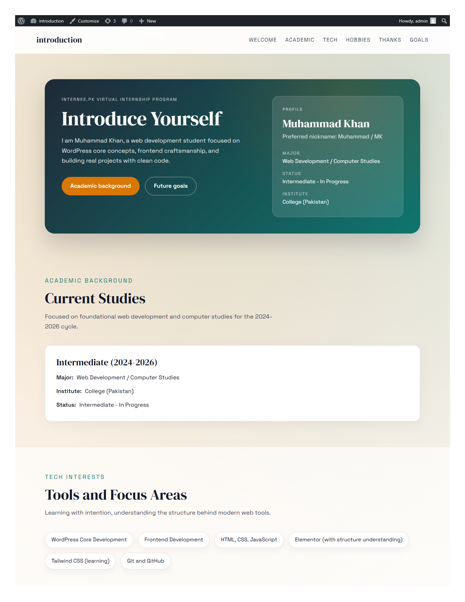

# Internee Profile - Introduce Yourself Theme

Custom WordPress theme built for the Internee.pk Virtual Internship "Introduce Yourself" project.
Built using drag-and-drop tools (Elementor).

Preview (click to open PDF):

## Contents
- `style.css`
- `functions.php`
- `header.php`
- `footer.php`
- `front-page.php`
- `index.php`
- `js/main.js`

## Setup
1. Copy this folder into `wp-content/themes/`.
2. Activate **Internee Profile** in WordPress.
3. Visit the home page to see the front-page layout.

## Notes
- Responsive layout for mobile and desktop.
